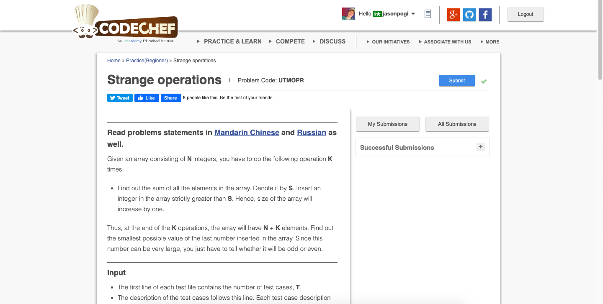

# Codechef-Strange-Operations
### Problem

### Program Simulation
<pre>
  Sample Input: 
  2 3
  5 7
  
  n = 2
  k = 3
  a[0] = 5
  a[1] = 7
  
  * Calculate sum of all elements in the array *
  
  sum = 12
  
  if(sum%2==0) // true
    if(k==1) // false
    else
      print even
  
  Final Output:
  even
</pre>
